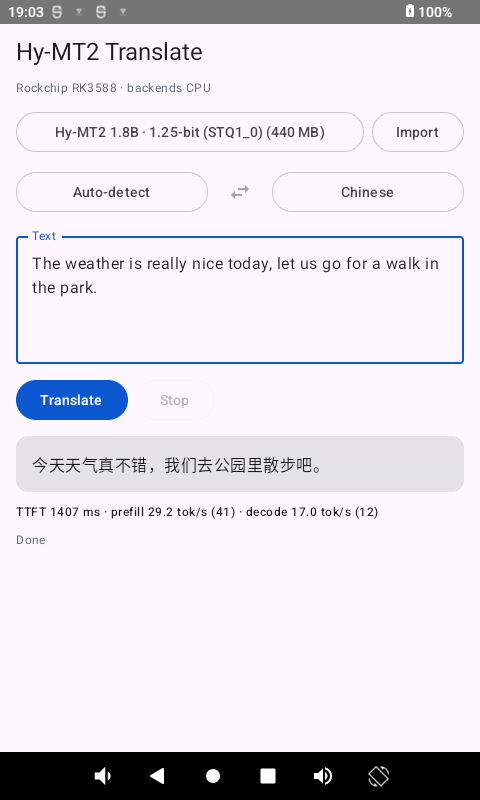

[English](README.en.md) | [简体中文](README.md)

# Hy-MT2 on Android (Rockchip / Qualcomm)

在 Android 手机和开发板上本地运行腾讯混元翻译模型 [Hy-MT2](https://github.com/Tencent-Hunyuan/Hy-MT2) 1.8B 的 App 与工具链。
基于 llama.cpp，包含 1.25-bit（STQ1_0）内核移植、预填充优化、线程池修复，以及按 SoC 自动选择后端和线程策略的 Kotlin/Compose 应用。

Run Tencent's Hy-MT2 1.8B translation model fully on-device on Android: a llama.cpp-based JNI engine with the 1.25-bit
STQ1_0 kernel, a faster prefill kernel, a threadpool fix, and a Compose app that picks backend and core pinning per SoC.

<p align="center"></p>
<p align="center"><sub>RK3588 板子上的截图：英→中翻译，1.25-bit 模型，4 个大核。底部统计来自一句很短的文本（41 个提示词 token、12 个输出 token），
首 token 与预热占比大，速度低于下方稳态基准。</sub></p>

## 状态 / Status

| 平台 | 状态 | 说明 |
|---|---|---|
| Rockchip RK3588 | **已在真机实测** | CPU（NEON dotprod）路径，见下方数据 |
| Qualcomm Snapdragon | **已在 1 台真机实测**（骁龙 8 Elite） | Hexagon NPU / Adreno OpenCL / CPU 均跑通；其他骁龙型号（HTP v73/v75/v81、Adreno 7xx）未测，详见 [docs/snapdragon.md](docs/snapdragon.md) |

RK3588 的 Mali GPU 和 NPU 在测试固件上走不通（OpenCL 后端不接受 Mali、Vulkan 只有 1.1、NPU 驱动 v0.8.2 过旧）。详见 [docs/rk3588.md](docs/rk3588.md)。

## 实测数据（RK3588，4×Cortex-A76 大核）

| 模型 | 大小 | 预填充 pp (t/s) | 解码 tg (t/s) |
|---|---|---|---|
| **STQ1_0 1.25bit + `token_embd` 降为 Q4_0（推荐）** | 375 MB | 46.5 | **24.8**（命令行）/ 22.2（App 内） |
| STQ1_0 原版 | 436 MB | 32.5（优化后 46.2） | 21.7–22.4 |
| Q4_0（4x4 repack） | 1.0 GB | **77.1** | 19.2（App 内 18.0） |
| Q4_K_M | 1.05 GB | 60.5 | 17.8 |

解码受内存带宽限制，模型越小越快；预填充受计算限制，Q4_0 最快。完整表格与复现方法：[docs/benchmarks.md](docs/benchmarks.md)。

## 做了什么

- **STQ1_0 内核移植**：Tencent 的 1.25-bit 模型依赖上游 llama.cpp 未合并的 [PR #22836](https://github.com/ggml-org/llama.cpp/pull/22836)，
  这里把它移植到较新的 master（`patches/llama.cpp/0001–0003`，原作者 jinlongsong）。
- **预填充 +43%**：给 STQ1_0 写了 2×2 dotprod tile 内核（每个权重块解码一次、与两列激活相乘），输出与原内核逐字节一致（`0004`）。
- **解码 +14%**：`token_embd`（同时是 lm_head，占模型近一半）从 Q6_K 降为 Q4_0（`scripts/requant_embd.py`），抽样的中/英/日译文基本一致。
- **线程池修复**：`GGML_BACKEND_DL` 构建下，llama.cpp 只给其中一个 CPU 后端设置线程池，调度器却在另一个后端上计算，
  导致每个 token 都新建一批线程、核心被降到最低频。修复后 App 内解码 17 → 22 t/s（`0005`）。
- **Android App**（`android/`）：JNI 引擎 + Compose 翻译界面、38 种语言、官方 Hy-MT2 提示词模板、流式输出、SoC 检测、
  大核绑定、双线程池策略、无头基准（`BenchActivity`）。

## 快速开始

需要：Android SDK + NDK 28.2.13676358、CMake、Ninja、JDK 17。

```bash
# 1. 获取并打补丁 llama.cpp（固定在 master de7fa0a）；GitHub 不通时用 LLAMA_GIT_URL=<镜像> 覆盖
scripts/setup_llama.sh

# 2. 准备模型（见下）后，构建并安装 App
cd android
./gradlew-run.sh :app:assembleDebug
adb install -r app/build/outputs/apk/debug/app-debug.apk
```

### 模型

**App 内直接下载**：打开 App，未安装的模型会显示在 “Download a model”，点 Download 即可，断点续传、自动校验 SHA-256，
1.25-bit 模型的类型 id（42→43）也由 App 自动修正。按设备推荐：带 Hexagon NPU 的骁龙推荐 Q4_0，其他设备推荐 1.25-bit。

**下载源默认是魔搭（ModelScope）**，国内可直连；hf-mirror.com 和 Hugging Face 仅作失败时的兜底。三处文件名与 SHA-256 完全一致。
来源仓库：[AngelSlim/Hy-MT2-1.8B-1.25Bit-GGUF](https://modelscope.cn/models/AngelSlim/Hy-MT2-1.8B-1.25Bit-GGUF)、
[unsloth/Hy-MT2-1.8B-GGUF](https://modelscope.cn/models/unsloth/Hy-MT2-1.8B-GGUF)。模型文件不在本仓库里，使用前请遵守 Hy-MT2 的许可。

没网或想用别的量化？手动安装、校验值、构建脚本在没有 GitHub 时的替代方式，见 [docs/models.md](docs/models.md)。
App 里的 **Import** 按钮也可以选本地文件。

### 命令行基准

```bash
scripts/build_android_cpu.sh                      # armv8.2-a+dotprod+fp16（RK3588 / A76）
adb push build/cpu-a76/bin/. /data/local/tmp/hymt2/lib/
adb shell "cd /data/local/tmp/hymt2 && LD_LIBRARY_PATH=lib taskset f0 ./lib/llama-bench -m <model>.gguf -t 4 -p 64 -n 32"
```

`taskset f0` 把进程限制在 RK3588 的大核（cpu4–7）。线程数不要超过绑定的核数，否则预填充会塌到约 10 t/s。

### 高通

```bash
SD_DL=1 scripts/build_snapdragon.sh # Docker 里构建 Hexagon / Adreno OpenCL 插件（App 用）；不带 SD_DL 是 adb 命令行用的整体构建
scripts/stage_snapdragon_libs.sh     # 拷到 android/app/src/main/jniLibs/arm64-v8a/
```

运行方式、各量化格式在各后端的支持矩阵、基准清单见 [docs/snapdragon.md](docs/snapdragon.md)。
按源码，Hexagon 和 Adreno 支持 Q4_0 但不支持 STQ1_0；STQ1_0 只走 CPU。**已在骁龙 8 Elite（荣耀 PPG-AN00，Android 17）上实测：Q4_0 走 Hexagon NPU 预填充约 1900 t/s、解码约 43 t/s；STQ1_0 走 CPU 解码约 36 t/s。** App 用的是 `SD_DL=1 scripts/build_snapdragon.sh`（插件形式的后端），不是默认的整体构建。

## 已知限制

- 2-bit（Q2_0C）模型不支持：上游没有对应内核，格式未公开。
- App 内解码约 22 t/s，命令行 24.8 t/s，还差一点。
- 单元测试只覆盖 `RuntimePolicy` / `CpuTopology` / `SocDetector`（9 个用例，JVM）；JNI 引擎和 UI 没有测试。
- 骁龙 8 Elite 上 STQ1_0 在 prime 核（cpu6/7）上线程池会停滞，App 已避开它们；根因未查明。
- 本仓库的 Android 前端参考了 [google-ai-edge/gallery](https://github.com/google-ai-edge/gallery) 的交互思路，没有复用其代码。

## 目录

```
android/            Kotlin + Compose 应用与 JNI 引擎
patches/llama.cpp/  对 llama.cpp 的 5 个补丁
scripts/            构建、模型转换、基准脚本
docs/               models / benchmarks / rk3588 / snapdragon
```

## 许可

本仓库代码以 [MIT](LICENSE) 发布。`patches/llama.cpp/` 是对 llama.cpp（MIT）的衍生修改，仍遵循其许可，
其中 `0001–0003` 来自上游 PR #22836（作者 jinlongsong）。**模型权重不包含在内**，受 Hy-MT2 自己的许可约束，请自行查阅。

## 致谢

[Tencent Hunyuan Hy-MT2](https://github.com/Tencent-Hunyuan/Hy-MT2)、[llama.cpp](https://github.com/ggml-org/llama.cpp)、
STQ1_0 内核作者（PR #22836）。
